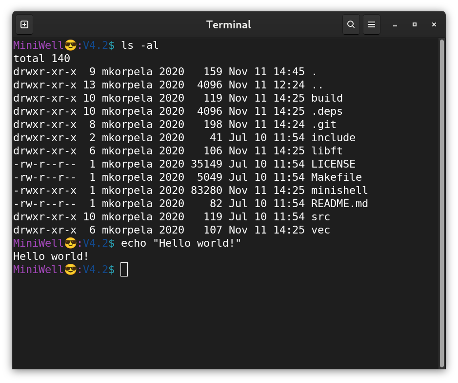

# minishell
A shell that mimics bash. A collab project with usmanUA (github).  

You read that right. This is a recreated bash, it does just about everything our friend bash does.

**How to run**:
1. Write into terminal - ./minishell  
2. Write your favourite (bash) command and watch the magic happen
  f.ex. ls -al, pwd, cd .. etc

  
